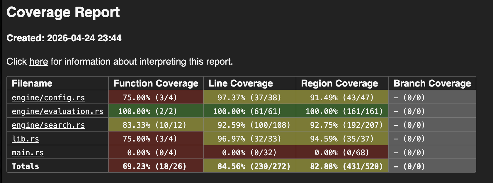
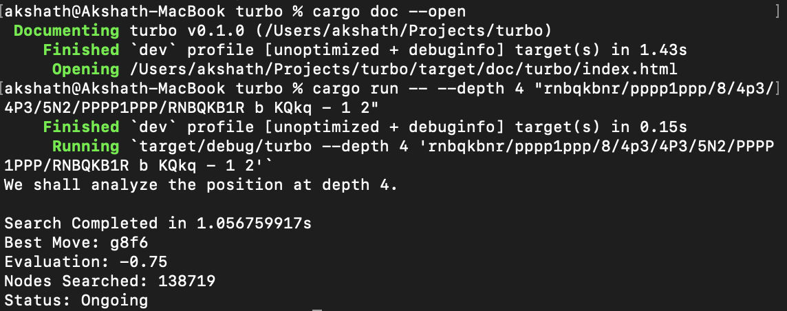

# Rust Chess Engine

A high-performance chess engine built in Rust, featuring a **Negamax search** with **Alpha-Beta pruning** and a **Tapered Evaluation** system. I have structured this project to utilize the library/binary split effectively, as well as manual trait implementations and external data processing.

## Features

- **Search Algorithm**: Implements **Negamax** with **Alpha-Beta Pruning** to navigate the search tree efficiently.
- **Quiescence Search**: Extends the search for captures and promotions until a stable board state is reached.
- **Tapered Evaluation**: Linearly interpolates between Midgame and Endgame scoring based on the remaining material on the board.
- **Positional Awareness**: Uses **PeSTO Piece-Square Tables** (deserialized via `serde` from JSON) to evaluate piece placement.
- **Professional CLI**: Powered by `clap`, allowing for easy FEN input and depth control.

## Testing
The line coverage as per llvm-cov is listed here.


## How to Use
### Running the Engine
Provide a FEN string and an optional depth (default is 5).


```bash
cargo run -- --depth 4 "rnbqkbnr/pppp1ppp/8/4p3/4P3/5N2/PPPP1PPP/RNBQKB1R b KQkq - 1 2"