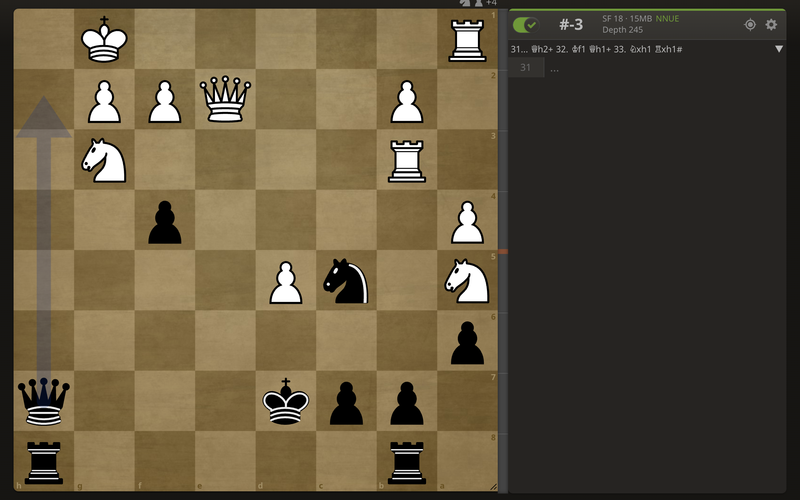

# Rust Chess Engine

A high-performance chess engine built in Rust, featuring a **Negamax search** with **Alpha-Beta pruning** and a **Tapered Evaluation** system. I have structured this project to utilize the library/binary split effectively, as well as manual trait implementations, external data processing, and command-line integration.

## Features

- **Search Algorithm**: Implements **Negamax** with **Alpha-Beta Pruning** to navigate the search tree efficiently.
- **Quiescence Search**: Extends the search for captures and promotions until a stable board state is reached.
- **Tapered Evaluation**: Linearly interpolates between Midgame and Endgame scoring based on the remaining material on the board.
- **Positional Awareness**: Uses **PeSTO Piece-Square Tables** (deserialized via `serde` from JSON) to evaluate piece placement.
- **User-Friendly CLI**: Powered by `clap`, allowing for easy FEN input and depth control.

## Testing
The line coverage as per llvm-cov is listed here.


## How to Use
### Running the Engine
Provide a FEN string and an optional depth (default is 5).

The sample provided here is an 1901 rated Lichess puzzle, in which at depth 6 the engine provides the optimal move and verifies that we have entered a mating sequence (which involves a queen sacrifice for line completion).



```bash
cargo run -- --depth 6 "1r5r/1ppk3q/p7/N1nP4/P4p2/1R4N1/1P2QPP1/R5K1 b - - 0 31"